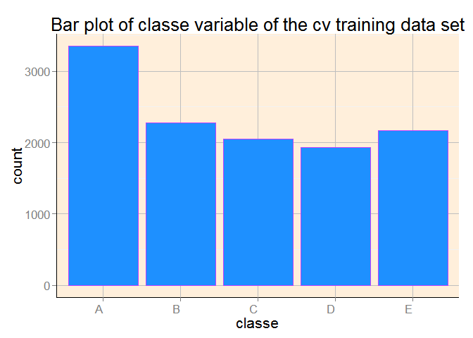
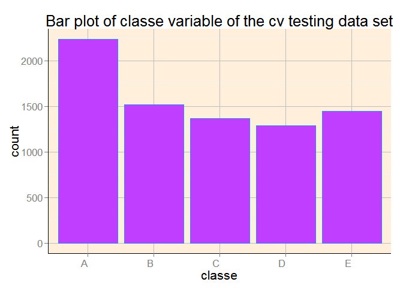
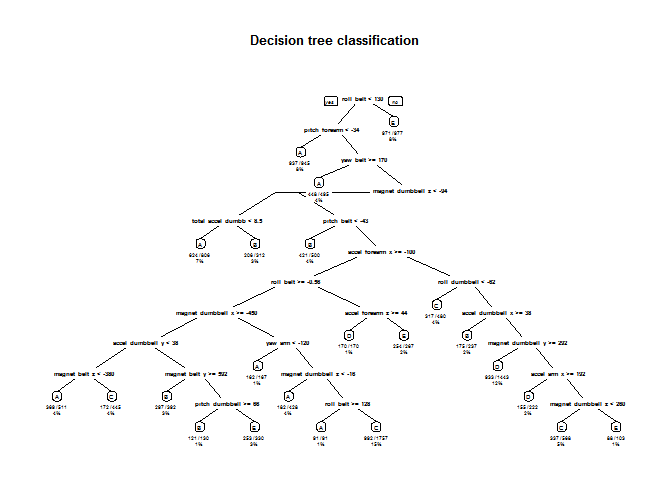

Background
==========

Using devices such as Jawbone Up, Nike FuelBand, and Fitbit it is now
possible to collect a large amount of data about personal activity
relatively inexpensively. These type of devices are part of the
quantified self movement – a group of enthusiasts who take measurements
about themselves regularly to improve their health, to find patterns in
their behavior, or because they are tech geeks. One thing that people
regularly do is quantify how much of a particular activity they do, but
they rarely quantify how well they do it. In this project, your goal
will be to use data from accelerometers on the belt, forearm, arm, and
dumbell of 6 participants. They were asked to perform barbell lifts
correctly and incorrectly in 5 different ways. More information is
available from the website here:
<http://groupware.les.inf.puc-rio.br/har> (see the section on the Weight
Lifting Exercise Dataset).

Data
====

The training data for this project are available here:

<https://d396qusza40orc.cloudfront.net/predmachlearn/pml-training.csv>

The test data are available here:

<https://d396qusza40orc.cloudfront.net/predmachlearn/pml-testing.csv>

Synopsis
========

### Reproduceability

For reproducability issues, we set a random seed 12345. In order to
reproduce the results, the same seed should be used. In this project the
code checks the availability, installs and and loads all the necessary R
libraries. Thus it can be used directly without any user input.

### Building the model

The variable is classe, a factor variable with 5 levels. For this data
set, “participants were asked to perform one set of 10 repetitions of
the Unilateral Dumbbell Biceps Curl in 5 different fashions:

<table>
<thead>
<tr class="header">
<th align="left">Fashion</th>
<th align="left">Class Label</th>
</tr>
</thead>
<tbody>
<tr class="odd">
<td align="left">exactly according to the specification</td>
<td align="left">A</td>
</tr>
<tr class="even">
<td align="left">throwing the elbows to the front</td>
<td align="left">B</td>
</tr>
<tr class="odd">
<td align="left">lifting the dumbbell only halfway</td>
<td align="left">C</td>
</tr>
<tr class="even">
<td align="left">lowering the dumbbell only halfway</td>
<td align="left">D</td>
</tr>
<tr class="odd">
<td align="left">throwing the hips to the front</td>
<td align="left">E</td>
</tr>
</tbody>
</table>

Two models will be tested: Decision trees and Random Forest algorithms.
The model with the highest accuracy will be chosen as the final model.

### Cross-validation

Cross-validation will be performed by subsampling our training data set
randomly without replacement into 2 subsamples: cvTraining data (60% of
the original Training data set) and cvTesting data (40%). The models
will be fitted on the cvTraining data set, and tested on the cvTesting
data. Once the most accurate model is choosen, it will be tested on the
original Testing data set.

### Expected out-of-sample error

The expected out-of-sample error will correspond to the quantity:
1-accuracy in the cross-validation data. Accuracy is the proportion of
correct classified observation over the total sample in the subTesting
data set. Expected accuracy is the expected accuracy in the
out-of-sample data set (i.e. original testing data set). Thus, the
expected value of the out-of-sample error will correspond to the
expected number of missclassified observations/total observations in the
Test data set, which is the quantity: 1-accuracy found from the
cross-validation data set.

### Reasons for choices

The outcome variable “classe” is an unordered factor variable. So, a
classification algorithm should be used. We have a large sample size
with N= 19622 in the Training data set. This allow us to divide our
Training sample into cvTraining and cvTesting to allow cross-validation.
Features with all missing values will be discarded as well as features
that are irrelevant. All other features will be kept as relevant
variables. Decision tree and random forest algorithms are known for
their ability of detecting the features that are important for
classification. Feature selection is inherent, so it is not so necessary
at the data preparation phase. Thus, there will not be any feature
selection section in this project.

Load required packages
======================

    # installing/loading the package:
    if(!require(ggplot2)) {
      install.packages("ggplot2"); require(ggplot2)} #load / install+load ggplot2

    # installing/loading the package:
    if(!require(caret)) {
      install.packages("caret"); require(caret)} #load / install+load caret

    # installing/loading the package:
    if(!require(rpart)) {
      install.packages("rpart"); require(rpart)} #load / install+load rpart

    # installing/loading the package:
    if(!require(rpart.plot)) {
      install.packages("rpart.plot"); require(rpart.plot)} #load / install+load rpart.plot

    ## Warning: package 'rpart.plot' was built under R version 3.1.3

    # installing/loading the package:
    if(!require(rattle)) {
      install.packages("rattle"); require(rattle)} #load / install+load rattle

    ## Warning: package 'rattle' was built under R version 3.1.3

    # installing/loading the package:
    if(!require(randomForest)) {
      install.packages("randomForest"); require(randomForest)} #load / install+load randomForest

    # Make nicer background theme in ggplot
    science_theme <- theme(panel.grid.major = element_line(size = 0.5, color = "grey"),
                           panel.background = element_rect(fill="antiquewhite1"), 
                           axis.line = element_line(size = 0.7, color = "black"), 
                           text = element_text(size = 16),
                           axis.text.x = element_text(angle = 0, hjust = 1))

Data loading and cleaning
=========================

The data are read and loaded directly from internet without need to
download them in local file. "\#DIV/0!","" values are immediately
converted to NA R values. This means that before constructing the code,
we already had a knowledge about the data. For reproducability issues,
we set a random seed.

    #URL for the training data set
    trainUrl <- "http://d396qusza40orc.cloudfront.net/predmachlearn/pml-training.csv"

    #URL for the testing data set
    testUrl <- "http://d396qusza40orc.cloudfront.net/predmachlearn/pml-testing.csv"

    # Load the data without saving in the local driver
    training <- read.csv(url(trainUrl), na.strings=c("NA","#DIV/0!",""))
    testing <- read.csv(url(testUrl), na.strings=c("NA","#DIV/0!",""))

    set.seed(12345)

Then, we delete the columns that contain missing values.

    # Delete columns with all missing values
    trainingset<-training[,colSums(is.na(training)) == 0]
    testingset <-testing[,colSums(is.na(testing)) == 0]

We also delete columns irrelevant for the current analysis (columns 1 to
7 in both training and testing data set).

    # Delete columns with all missing values
    trainingset <-trainingset[,-c(1:7)]
    testingset <-testingset[,-c(1:7)]

Then we test whether we have variables that present near to zero
variability.

    nsv <- nearZeroVar(trainingset, saveMetrics=TRUE)
    nsv

    ##                      freqRatio percentUnique zeroVar   nzv
    ## roll_belt             1.101904     6.7781062   FALSE FALSE
    ## pitch_belt            1.036082     9.3772296   FALSE FALSE
    ## yaw_belt              1.058480     9.9734991   FALSE FALSE
    ## total_accel_belt      1.063160     0.1477933   FALSE FALSE
    ## gyros_belt_x          1.058651     0.7134849   FALSE FALSE
    ## gyros_belt_y          1.144000     0.3516461   FALSE FALSE
    ## gyros_belt_z          1.066214     0.8612782   FALSE FALSE
    ## accel_belt_x          1.055412     0.8357966   FALSE FALSE
    ## accel_belt_y          1.113725     0.7287738   FALSE FALSE
    ## accel_belt_z          1.078767     1.5237998   FALSE FALSE
    ## magnet_belt_x         1.090141     1.6664968   FALSE FALSE
    ## magnet_belt_y         1.099688     1.5187035   FALSE FALSE
    ## magnet_belt_z         1.006369     2.3290184   FALSE FALSE
    ## roll_arm             52.338462    13.5256345   FALSE FALSE
    ## pitch_arm            87.256410    15.7323412   FALSE FALSE
    ## yaw_arm              33.029126    14.6570176   FALSE FALSE
    ## total_accel_arm       1.024526     0.3363572   FALSE FALSE
    ## gyros_arm_x           1.015504     3.2769341   FALSE FALSE
    ## gyros_arm_y           1.454369     1.9162165   FALSE FALSE
    ## gyros_arm_z           1.110687     1.2638875   FALSE FALSE
    ## accel_arm_x           1.017341     3.9598410   FALSE FALSE
    ## accel_arm_y           1.140187     2.7367241   FALSE FALSE
    ## accel_arm_z           1.128000     4.0362858   FALSE FALSE
    ## magnet_arm_x          1.000000     6.8239731   FALSE FALSE
    ## magnet_arm_y          1.056818     4.4439914   FALSE FALSE
    ## magnet_arm_z          1.036364     6.4468454   FALSE FALSE
    ## roll_dumbbell         1.022388    84.2065029   FALSE FALSE
    ## pitch_dumbbell        2.277372    81.7449801   FALSE FALSE
    ## yaw_dumbbell          1.132231    83.4828254   FALSE FALSE
    ## total_accel_dumbbell  1.072634     0.2191418   FALSE FALSE
    ## gyros_dumbbell_x      1.003268     1.2282132   FALSE FALSE
    ## gyros_dumbbell_y      1.264957     1.4167771   FALSE FALSE
    ## gyros_dumbbell_z      1.060100     1.0498420   FALSE FALSE
    ## accel_dumbbell_x      1.018018     2.1659362   FALSE FALSE
    ## accel_dumbbell_y      1.053061     2.3748853   FALSE FALSE
    ## accel_dumbbell_z      1.133333     2.0894914   FALSE FALSE
    ## magnet_dumbbell_x     1.098266     5.7486495   FALSE FALSE
    ## magnet_dumbbell_y     1.197740     4.3012945   FALSE FALSE
    ## magnet_dumbbell_z     1.020833     3.4451126   FALSE FALSE
    ## roll_forearm         11.589286    11.0895933   FALSE FALSE
    ## pitch_forearm        65.983051    14.8557741   FALSE FALSE
    ## yaw_forearm          15.322835    10.1467740   FALSE FALSE
    ## total_accel_forearm   1.128928     0.3567424   FALSE FALSE
    ## gyros_forearm_x       1.059273     1.5187035   FALSE FALSE
    ## gyros_forearm_y       1.036554     3.7763735   FALSE FALSE
    ## gyros_forearm_z       1.122917     1.5645704   FALSE FALSE
    ## accel_forearm_x       1.126437     4.0464784   FALSE FALSE
    ## accel_forearm_y       1.059406     5.1116094   FALSE FALSE
    ## accel_forearm_z       1.006250     2.9558659   FALSE FALSE
    ## magnet_forearm_x      1.012346     7.7667924   FALSE FALSE
    ## magnet_forearm_y      1.246914     9.5403119   FALSE FALSE
    ## magnet_forearm_z      1.000000     8.5771073   FALSE FALSE
    ## classe                1.469581     0.0254816   FALSE FALSE

As we can see, all values are false. Thus, we will keep all these
variables in the analysis.

Finally, we check whether the columns in the training and testing data
match.

    #check if we have the same column names in the two data sets
    all.equal(colnames(trainingset[,1:(ncol(trainingset) - 1)]), colnames(testingset[,1:(ncol(testingset) - 1)]))

    ## [1] TRUE

Create cross-validation data sets
=================================

We are dividing the data set to 60% training and 40% testing sets for
cross-validation purposes.

    cvdata <- createDataPartition(y=trainingset$classe, p=0.6, list=FALSE)
    cvTraining <- trainingset[cvdata, ]
    cvTesting <- trainingset[-cvdata, ]

The training data set for cross validation has dimensions 11776, 53, and
the testing data set for cross validation has dimensions 7846, 53.
Hence, we have 52 predictors.

Now, we have a clean data set where we can apply our machine learning
algorithms.

Data exploration
================

Let us first have a visual sense of the data. The following plot
presents the frequency of each class.

    barplot_traning <- ggplot(trainingset, aes(x=classe)) + 
      geom_bar(color = "darkorchid1", fill = "dodgerblue1") + 
      labs(title = "Bar plot of classe variable of the training data set") +
      science_theme 
    barplot_traning

Now, let us see if the partitioning resulted in the same pattern.

    barplot_traning_cv <- ggplot(cvTraining, aes(x=classe)) + 
      geom_bar(color = "darkorchid1", fill = "dodgerblue1") + 
      labs(title = "Bar plot of classe variable of the cv training data set") +
      science_theme 
    barplot_traning_cv

    barplot_testing_cv <- ggplot(cvTesting, aes(x=classe)) + 
      geom_bar(color = "dodgerblue1", fill = "darkorchid1") + 
      labs(title = "Bar plot of classe variable of the cv testing data set") +
      science_theme 
    barplot_testing_cv

As we can see, the pattern remained the same in the two data sets (as it
is in the original training data set). So we can expect that an
algorithm that performs well in the cv training data set will perform
the same in the cv testing data set.

Now, we have a clean data set where we can apply our machine learning
algorithms.

Decision trees classification
=============================

First, let us use the Decision trees classification algorithm using the
rpart function. We will train our model using the 60% of the training
data set (cvTraining).

    dectree <- rpart(classe ~ ., data=cvTraining, method="class")

    #Plot of the decision tree
    rpart.plot(dectree, main="Decision tree classification", extra=102, under=TRUE, faclen=0)

Now, let us use the rest 40% of the data set for prediction (cvTesting).

    pred_dectree <- predict(dectree, cvTesting, type = "class")

    #Confusion matrix
    confusionMatrix(pred_dectree, cvTesting$classe)

    ## Confusion Matrix and Statistics
    ## 
    ##           Reference
    ## Prediction    A    B    C    D    E
    ##          A 1879  260   30   69   66
    ##          B   56  759   88   34   54
    ##          C  105  340 1226  354  234
    ##          D  155  132   23  807   57
    ##          E   37   27    1   22 1031
    ## 
    ## Overall Statistics
    ##                                           
    ##                Accuracy : 0.7267          
    ##                  95% CI : (0.7167, 0.7366)
    ##     No Information Rate : 0.2845          
    ##     P-Value [Acc > NIR] : < 2.2e-16       
    ##                                           
    ##                   Kappa : 0.6546          
    ##  Mcnemar's Test P-Value : < 2.2e-16       
    ## 
    ## Statistics by Class:
    ## 
    ##                      Class: A Class: B Class: C Class: D Class: E
    ## Sensitivity            0.8418  0.50000   0.8962   0.6275   0.7150
    ## Specificity            0.9243  0.96334   0.8405   0.9441   0.9864
    ## Pos Pred Value         0.8155  0.76589   0.5427   0.6874   0.9222
    ## Neg Pred Value         0.9363  0.88928   0.9746   0.9282   0.9389
    ## Prevalence             0.2845  0.19347   0.1744   0.1639   0.1838
    ## Detection Rate         0.2395  0.09674   0.1563   0.1029   0.1314
    ## Detection Prevalence   0.2937  0.12631   0.2879   0.1496   0.1425
    ## Balanced Accuracy      0.8831  0.73167   0.8684   0.7858   0.8507

As we can see from the results of the confusion matrix, we have an
accuracy of 0.7267 with 95% CI (0.7167, 0.7366). We can infer that
simple decision trees are not the best choice for our data set since we
do not have a good accuracy. We will now test Random Forest
classification to check if the accuracy will increase.

Random Forest classification
============================

    rf <- randomForest(classe ~. , data=cvTraining)

    pred_rf <- predict(rf, cvTesting, type = "class")

    confusionMatrix(pred_rf, cvTesting$classe)

    ## Confusion Matrix and Statistics
    ## 
    ##           Reference
    ## Prediction    A    B    C    D    E
    ##          A 2229    7    0    0    0
    ##          B    3 1505    5    0    0
    ##          C    0    6 1363   16    2
    ##          D    0    0    0 1268    4
    ##          E    0    0    0    2 1436
    ## 
    ## Overall Statistics
    ##                                           
    ##                Accuracy : 0.9943          
    ##                  95% CI : (0.9923, 0.9958)
    ##     No Information Rate : 0.2845          
    ##     P-Value [Acc > NIR] : < 2.2e-16       
    ##                                           
    ##                   Kappa : 0.9927          
    ##  Mcnemar's Test P-Value : NA              
    ## 
    ## Statistics by Class:
    ## 
    ##                      Class: A Class: B Class: C Class: D Class: E
    ## Sensitivity            0.9987   0.9914   0.9963   0.9860   0.9958
    ## Specificity            0.9988   0.9987   0.9963   0.9994   0.9997
    ## Pos Pred Value         0.9969   0.9947   0.9827   0.9969   0.9986
    ## Neg Pred Value         0.9995   0.9979   0.9992   0.9973   0.9991
    ## Prevalence             0.2845   0.1935   0.1744   0.1639   0.1838
    ## Detection Rate         0.2841   0.1918   0.1737   0.1616   0.1830
    ## Detection Prevalence   0.2850   0.1928   0.1768   0.1621   0.1833
    ## Balanced Accuracy      0.9987   0.9951   0.9963   0.9927   0.9978

As expected, classification using Random Forests outperformed Decision
trees with an accuracy of 0.9943 with 95% CI (0.9923, 0.9958). Thus, we
decide to use Random Forests as the best model to create the submission
files.

### Out-of-sample error

The expected out-of-sample error is calculated as 1 - accuracy for
predictions made against the cross-validation set. In this case, the
out-of-sample error is 0.0057 or 0.57%. Hence, we expect almost none (if
not completely none) misclassifications.

Create the submission files
===========================

Finally, as we decided to use Random Forests for the submission data
sets, let us have a look of the predicted classes of the 20 new
subjects.

    pred_new <- predict(rf, testingset[,-53], type = "class")
    pred_new

    ##  1  2  3  4  5  6  7  8  9 10 11 12 13 14 15 16 17 18 19 20 
    ##  B  A  B  A  A  E  D  B  A  A  B  C  B  A  E  E  A  B  B  B 
    ## Levels: A B C D E

The code to create the submission files is given by:

    pml_write_files = function(x){
      n = length(x)
      for(i in 1:n){
        filename = paste0("problem_id_",i,".txt")
        write.table(x[i],file=filename,quote=FALSE,row.names=FALSE,col.names=FALSE)
      }
    }

    #Run if you want to create the files
    #pml_write_files(pred_new)
